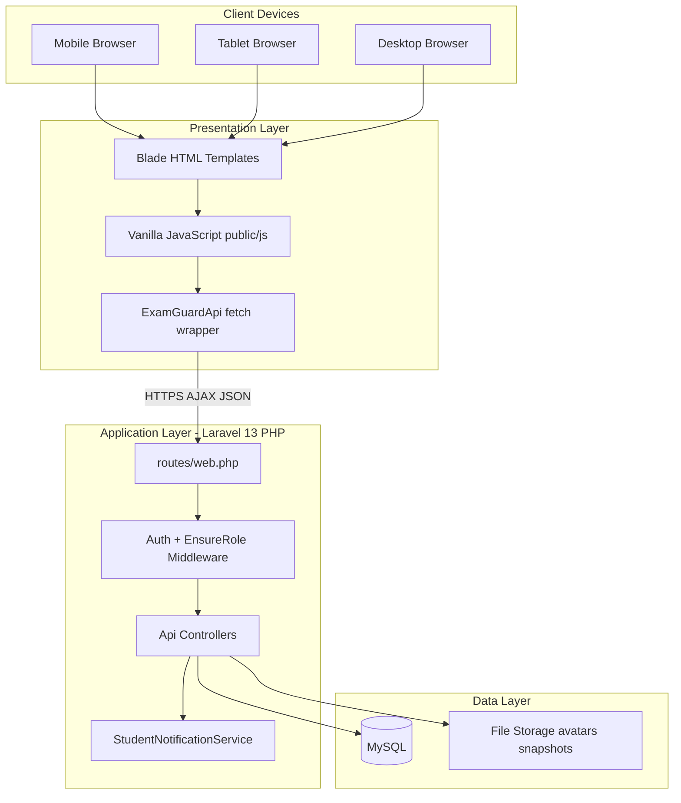
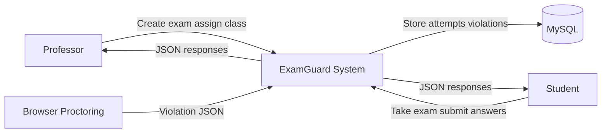
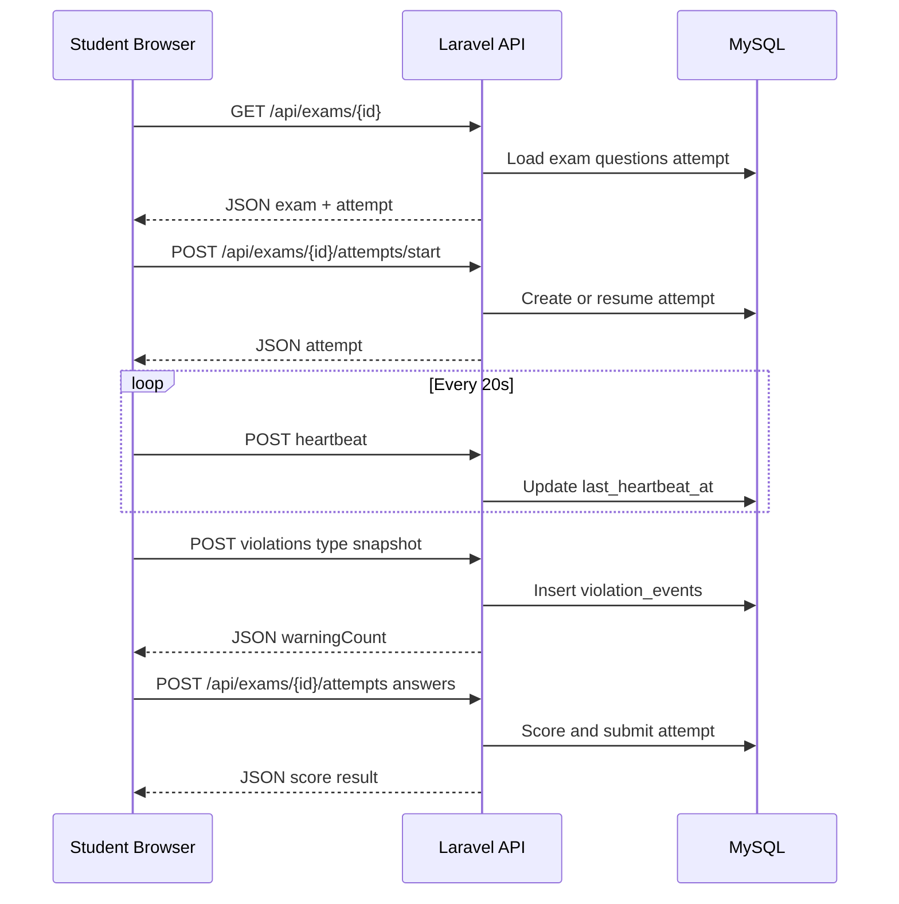
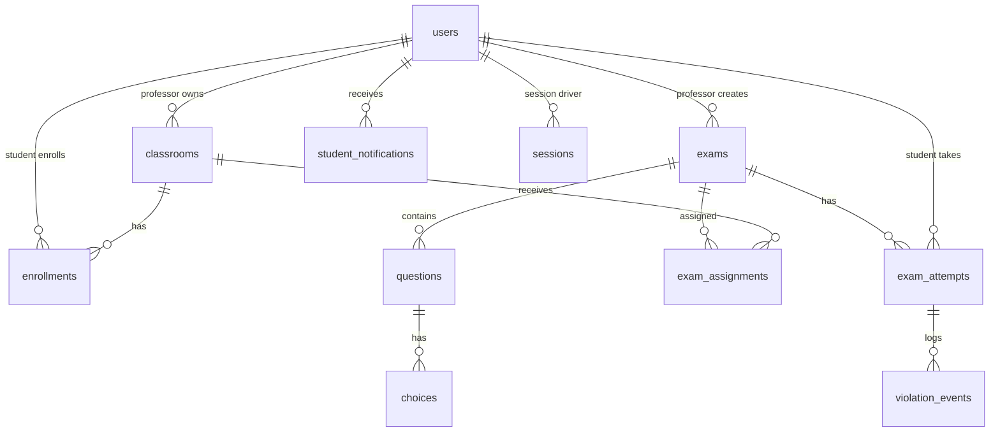

# ExamGuard — Project Documentation (BSCpE Mobile & Web Application Development Rubric)

**Polytechnic University of the Philippines**  
**Department of Computer Engineering**

| Field | Value |
|-------|--------|
| **Project Title** | ExamGuard — Online Examination & Proctoring Platform |
| **Group**| *Group 4* |
| **Date** | *June 30, 2026* |
| **CYS** | *BSCPE 3-7* |
| **Semester / S.Y.** | *2nd Sem 2025-2026* |

**Related files:** [README.md](README.md) · [DOCUMENTATION.md](DOCUMENTATION.md) · [INFINITYFREE.md](INFINITYFREE.md)

---

## Table of contents

1. [I. Project Documentation & Planning](#i-project-documentation--planning-15-pts)
2. [II. Responsive Website Design](#ii-responsive-website-design-20-pts)
3. [III. PHP Session Management](#iii-php-session-management-15-pts)
4. [IV. AJAX Implementation](#iv-ajax-implementation-20-pts)
5. [V. JSON Data Handling](#v-json-data-handling-15-pts)
6. [VI. Database Integration](#vi-database-integration-10-pts)
7. [VII. Mobile Application](#vii-mobile-application-15-pts)
8. [VIII. Presentation & Defense Guide](#viii-presentation--defense-10-pts)
9. [Rubric self-assessment summary](#rubric-self-assessment-summary)

---

## I. PROJECT DOCUMENTATION & PLANNING (15 pts)

### 1.1 Project proposal & objectives

#### Background

Schools need a way to conduct timed online exams while discouraging cheating (tab switching, absence from camera, etc.). ExamGuard is a **web-based** examination platform where professors create and monitor exams and students take them from any device with a browser.

#### Problem statement

Traditional online quizzes lack proctoring, role separation, and structured exam lifecycles (draft → scheduled → active → closed). ExamGuard centralizes exam creation, assignment, attempt tracking, and browser-based monitoring.

#### Objectives (measurable)

| # | Objective | How it is met |
|---|-----------|----------------|
| 1 | Allow professors to create, schedule, and manage exams with multiple-choice questions | Exam builder (`create-exam.js`), `ExamController` CRUD |
| 2 | Allow students to join classes and take timed exams | `student.js`, `take-exam.js`, `AttemptController` |
| 3 | Enforce **role-based access** (professor vs. student) | `EnsureRole` middleware, `users.role` |
| 4 | Provide **live exam monitoring** for professors | `professor-live-sessions.js`, heartbeat + polling |
| 5 | Detect proctoring events (tab switch, no face, etc.) and record warnings | `monitoring.js`, `AttemptController::reportViolation` |
| 6 | Deliver a **responsive** UI on mobile, tablet, and desktop | CSS Grid/Flexbox + media queries in Blade/CSS |
| 7 | Use **AJAX + JSON** for data operations without full page reloads | `ExamGuardApi` (`api-client.js`), `/api/*` controllers |

#### Scope

- User registration/login with email verification  
- Professor dashboard: exams, classes, results, proctoring, settings  
- Student dashboard: home, calendar, exam room, results, settings  
- Take-exam flow with preflight checks, timer, submit  
- Browser-based proctoring (demo mode — assistive, not forensic security)  
- MySQL persistence, session authentication  

#### Limitations

- Proctoring is **client-side** and can be bypassed by a determined user  
- No native iOS/Android store app (responsive **mobile web** + camera APIs)  
- Email on free hosting requires external SMTP (Brevo/SendGrid)  
- InfinityFree: no SSH, no queue workers, no foreign keys on shared MySQL  
- No offline exam taking  

---

### 1.2 System design & architecture

#### High-level system architecture



#### Data flow (DFD — Level 0)



#### Data flow — Student takes exam (DFD — Level 1)



#### Entity-relationship diagram (core tables)



**Primary entities:** `users`, `classrooms`, `enrollments`, `exams`, `questions`, `choices`, `exam_assignments`, `exam_attempts`, `violation_events`, `student_notifications`, `sessions`

---

### 1.3 User documentation

| Document | Contents |
|----------|----------|
| [README.md](README.md) | Installation (XAMPP), seed accounts, project structure |
| [DOCUMENTATION.md](DOCUMENTATION.md) | Full technical reference, API, AJAX, flows |
| [INFINITYFREE.md](INFINITYFREE.md) | Production deployment on free hosting |
| [docs/SMTP.md](docs/SMTP.md) | Email verification (Brevo/SendGrid) |

#### Installation (summary)

```powershell
composer install
npm install
npm run build
cp .env.example .env
php artisan key:generate
php artisan migrate --seed
php artisan storage:link
php artisan serve
```

Open **http://localhost:8000**

#### Default accounts

| Role | Email | Password |
|------|-------|----------|
| Professor | `professor@examguard.local` | `Professor123!` |
| Student | `student@examguard.local` | `Student123!` |

#### Basic usage

**Professor:** Log in → Exams → Create exam → Assign to class → Schedule → Monitor live sessions during exam → Review results.

**Student:** Log in → Join class (code) or enter exam key → Take exam when active → Complete preflight (camera) → Submit → View results.

*(Add screenshots of login, professor dashboard, student dashboard, and take-exam to the printed submission.)*

---

## II. RESPONSIVE WEBSITE DESIGN (20 pts)

### 2.1 Mobile responsiveness

ExamGuard uses **CSS Flexbox and Grid** (not Bootstrap) with **Tailwind CSS v4** on marketing/auth pages and custom `.pg-*` / `.sd-*` / `.te-*` layouts on dashboards.

| Page | Responsive behavior |
|------|---------------------|
| Marketing (`/`, `/tour`) | Tailwind responsive utilities, mobile nav toggle |
| Professor dashboard | Sidebar collapses; stats grids reflow |
| Student dashboard | Calendar and cards stack on narrow screens |
| Take exam | Question panel and camera stack below 768px |

**Evidence:** `resources/views/pages/professor.blade.php`, `student.blade.php`, `take-exam.blade.php`, `resources/views/layouts/app.blade.php`

---

### 2.2 CSS media queries & breakpoints

Breakpoints used (meet rubric: mobile ≤576px, tablet ≤992px, desktop >992px):

| Breakpoint | Typical use |
|------------|-------------|
| `max-width: 640px` | Small mobile — professor stats, forms |
| `max-width: 720px` | Student layout columns |
| `max-width: 768px` | Tablet portrait — sidebars, exam layout |
| `max-width: 900px` | Tablet — sidebar width, footer offset |
| `max-width: 1023px` | Student calendar |
| `max-width: 1100px` | Take-exam two-column → single column |

**Example** (`layouts/app.blade.php`):

```css
@media (max-width: 900px) {
  body.eg-shell-body[data-role="professor"] {
    --eg-sidebar-width: 64px;
  }
}
@media (max-width: 768px) {
  body.eg-shell-body[data-role="student"] {
    --eg-sidebar-width: 64px;
  }
}
```

All pages include `<meta name="viewport" content="width=device-width, initial-scale=1.0">`.

---

### 2.3 UI/UX design quality

| Aspect | Implementation |
|--------|----------------|
| Color scheme | Consistent navy/teal professor theme (`.pg-*`), blue student theme (`.sd-*`) |
| Typography | Plus Jakarta Sans, Space Grotesk (Google Fonts) |
| Hierarchy | Page titles, card headers, table labels |
| Navigation | Sidebar views with `data-view` switching; active state on nav links |
| Feedback | `ExamGuardDialog` toasts and confirm modals |
| Accessibility | `prefers-reduced-motion` media queries; ARIA on notification toggles |

---

### 2.4 Cross-browser compatibility

**Target browsers:** Chrome, Firefox, Edge, Safari (desktop and mobile)

| Feature | Chrome/Edge | Firefox | Safari |
|---------|-------------|---------|--------|
| Session login | ✓ | ✓ | ✓ |
| AJAX API | ✓ | ✓ | ✓ |
| Camera proctoring | ✓ | ✓ | ✓ (HTTPS required) |
| MediaPipe CDN | ✓ | ✓ | ✓ |

**Testing checklist for defense demo:**

- [ ] Login as professor and student in Chrome  
- [ ] Repeat login in Firefox or Edge  
- [ ] Open student take-exam on mobile Safari or Chrome Android (HTTPS)  

---

## III. PHP SESSION MANAGEMENT (15 pts)

ExamGuard uses **Laravel session management** (built on PHP sessions). This satisfies the rubric’s session requirements at framework level.

### 3.1 Session implementation

| Rubric expectation | ExamGuard implementation |
|--------------------|---------------------------|
| `session_start()` | Laravel starts session automatically per request |
| Set session variables | `Auth::login($user)` stores authenticated user in session |
| Update session | Profile updates persist user; `session()->regenerate()` on login |
| Destroy session | `Auth::logout()` + `session()->invalidate()` in `AuthController::logout` |
| Session storage | `SESSION_DRIVER=database` → `sessions` table |

**Files:** `app/Http/Controllers/Api/AuthController.php`, `config/session.php`, migration `0001_01_01_000000_create_users_table.php` (sessions table)

---

### 3.2 Authentication & access control

| Feature | Implementation |
|---------|----------------|
| Login | `POST /api/auth/login` — validates credentials + role |
| Logout | `POST /api/auth/logout` |
| Protected routes | `Route::middleware('auth')` on all `/api/*` and dashboard pages |
| Role-based access | `EnsureRole` middleware — `role:professor`, `role:student` |
| Guest redirect | `redirectGuestsTo('/login')` in `bootstrap/app.php` |
| Client guard | `auth-guard.js` calls `/api/auth/me` on dashboard load |

**Unauthorized access:** API returns `403` JSON; web routes redirect to correct dashboard or login.

---

### 3.3 Session security practices

| Practice | Implementation |
|----------|----------------|
| Session ID regeneration | `$request->session()->regenerate()` after successful login |
| HTTPS awareness | `trustProxies(at: '*')` in `bootstrap/app.php`; `APP_URL` HTTPS in production |
| Session lifetime | `SESSION_LIFETIME=480` (8 hours) |
| CSRF protection | `X-CSRF-TOKEN` header on all AJAX requests |
| XSS mitigation | Blade `{{ }}` escaping; JS `escapeHtml()` in notification lists |
| Brute-force protection | Rate limiting on login (`throttle:login`, 5 attempts / 15 min) |
| Password hashing | `bcrypt` via Laravel `Hash` |

---

## IV. AJAX IMPLEMENTATION (20 pts)

### 4.1 AJAX request handling

**Central client:** `public/js/api-client.js` → `window.ExamGuardApi`

- Uses **`fetch()`** API (modern AJAX)  
- `credentials: "same-origin"` for session cookie  
- Correct HTTP methods: GET, POST, PUT, DELETE  
- **15+ features** use AJAX (exceeds rubric minimum of 2)

| Feature | Method | Endpoint |
|---------|--------|----------|
| Login | POST | `/api/auth/login` |
| Load student dashboard | GET | `/api/me`, `/api/classes`, `/api/exams` |
| Create exam | POST | `/api/exams` |
| Submit exam | POST | `/api/exams/{id}/attempts` |
| Live sessions | GET | `/api/professor/live-sessions` |
| Report violation | POST | `/api/.../violations` |

Full mapping: [DOCUMENTATION.md §9](DOCUMENTATION.md#9-ajax-and-json)

---

### 4.2 Asynchronous UX behavior

| UX pattern | Where |
|------------|--------|
| No full reload on dashboard | `student.js` `loadDashboard()` |
| View switching without reload | `professor.js` `switchView()` |
| Polling live sessions | `professor-live-sessions.js` every 4s |
| Exam heartbeat | `take-exam.js` every 20s |
| Loading states | Notification panels: "Loading notifications…" |
| Toasts on success/error | `ExamGuardDialog` in `professor-exams.js`, etc. |

Professor exam table **initial** load is server-rendered (Blade); all mutations are AJAX.

---

### 4.3 Error handling in AJAX

`api-client.js` `request()` function:

- Parses JSON error body on non-2xx responses  
- Throws `Error` with `message`, `status`, `errors`, `locked_out`, `needs_verification`  
- Sanitizes SQL errors from user-facing messages  
- UI catches errors and shows dialogs/toasts  

**Example** (`professor-exams.js`):

```javascript
try {
  await ExamGuardApi.deleteExam(examId);
  dialog()?.toast('Exam deleted.', 'success');
} catch (error) {
  await dialog()?.alert({ type: 'error', message: error.message });
}
```

---

### 4.4 PHP backend integration with AJAX

All `/api/*` routes map to `app/Http/Controllers/Api/*.php`:

1. Receive JSON request body (`$request->validate(...)`)  
2. Query/update database via Eloquent  
3. Return `response()->json([...])`  

**Example flow:** `take-exam.js` → `POST /api/exams/5/attempts` → `AttemptController::store()` → scores answers → returns `{ attempt: { score, total } }`

---

## V. JSON DATA HANDLING (15 pts)

### 5.1 JSON encoding & decoding (PHP)

| Rubric | Laravel equivalent |
|--------|-------------------|
| `json_encode()` | `response()->json($data)` |
| `json_decode()` | `$request->input()` / `$request->validate()` on JSON body |
| `Content-Type: application/json` | Set by Laravel JSON responses; client sends `Accept: application/json` |

**Response examples:**

```json
{ "user": { "id": 1, "name": "...", "role": "student" } }
{ "exams": [ { "id": 5, "title": "Midterm", "status": "active" } ] }
{ "error": "Exam not assigned." }
```

---

### 5.2 JSON parsing in JavaScript

```javascript
const result = await response.json();
const { exams } = await ExamGuardApi.exams();
state.exams = exams || [];
renderHome(); // DOM update without reload
```

`ExamGuardApi` wraps all parsing; feature scripts destructure JSON and update the DOM.

---

### 5.3 Data integrity & validation

| Layer | Mechanism |
|-------|-----------|
| Server | Laravel `$request->validate()` on all API inputs |
| Server | Eloquent mass assignment guards; role checks in controllers |
| Server | `EnsureRole` middleware |
| Client | Form validation in `login.js`, `register.js`, `create-exam.js` |
| SQL injection | Eloquent prepared statements (no raw user SQL) |
| XSS | Blade escaping; `escapeHtml()` in dynamic HTML strings |
| CSRF | Token on every mutating request |

Malformed JSON: empty object fallback in `api-client.js`; validation errors return `errors` object.

---

## VI. DATABASE INTEGRATION (10 pts)

### 6.1 CRUD operations

All CRUD via **Eloquent ORM** (PDO prepared statements under the hood), triggered by **AJAX + JSON**:

| Entity | Create | Read | Update | Delete |
|--------|--------|------|--------|--------|
| Exams | `POST /api/exams` | `GET /api/exams/{id}` | `PUT /api/exams/{id}` | `DELETE /api/exams/{id}` |
| Classes | `POST /api/classes` | `GET /api/professor/classes` | — | `DELETE /api/classes/{id}` |
| Attempts | `POST .../attempts/start` | `GET /api/exams` | — | — |
| Profile | — | `GET /api/auth/me` | `PUT /api/auth/profile` | `DELETE /api/auth/account` |
| Violations | `POST .../violations` | `GET /api/professor/violations` | — | — |

---

### 6.2 Database design

- **Normalization:** Separate tables for users, classrooms, enrollments, exams, questions, choices, assignments, attempts, violations (3NF)  
- **Primary keys:** `id` on all tables  
- **Foreign keys:** Defined in migrations (local MySQL); stripped for InfinityFree import  
- **Indexes:** On `sessions.user_id`, unique constraints on `class_code`, `(exam_id, student_id)`, etc.  
- **JSON columns:** `users.preferences`, `exam_attempts.answers_json`, `exams.proctoring_triggers_json`  

**Schema reference:** [DOCUMENTATION.md §5](DOCUMENTATION.md#5-database-schema)

---

## VII. MOBILE APPLICATION (15 pts)

ExamGuard is implemented as a **responsive mobile web application** that runs in the device browser. Core features are accessible on phones and tablets without a separate native APK/IPA.

### 7.1 Mobile app functionality

| Core feature | Mobile web support |
|--------------|-------------------|
| Login / register | ✓ Responsive auth pages |
| Student dashboard | ✓ `student.blade.php` breakpoints |
| Take exam | ✓ `take-exam.blade.php` stacks layout on mobile |
| Camera proctoring | ✓ `getUserMedia` + MediaPipe in mobile Chrome/Safari (HTTPS) |
| Professor monitoring | ✓ Usable on tablet; dense tables on small phones |

**Demo tip:** Use Chrome DevTools device mode or a real phone on `https://examguard.site.je`.

---

### 7.2 API / backend connectivity

The mobile browser uses the **same REST-style JSON API** as desktop:

- `ExamGuardApi` → `fetch('/api/...')`  
- Session cookie authentication (no separate native token)  
- Works on InfinityFree / any HTTPS host  

This matches the rubric’s “mobile app communicates with PHP backend via JSON.”

---

### 7.3 Mobile-specific features

| Native / device feature | Integration |
|-------------------------|-------------|
| **Camera** | Exam preflight + face detection (`monitoring.js`, MediaPipe) |
| **Microphone** | Preflight check in `take-exam.js` |
| **Fullscreen API** | Monitored during exam (`fullscreen_exit` violation) |
| **Visibility API** | Tab switch detection (`visibilitychange`) |
| **Local storage** | `sessionStorage` for route state, draft exam builder |

**Future enhancement (optional):** PWA manifest + “Add to Home Screen” for app-icon experience.

---

## VIII. PRESENTATION & DEFENSE (10 pts)

### 8.1 Suggested presentation flow (15–20 minutes)

| # | Segment | Time | Content |
|---|---------|------|---------|
| 1 | Introduction | 2 min | Problem, objectives, team roles |
| 2 | Architecture | 3 min | Show architecture + ER diagrams (this doc) |
| 3 | Live demo — Professor | 4 min | Login → create exam → assign → live sessions |
| 4 | Live demo — Student | 4 min | Login → take exam → proctoring warning → submit |
| 5 | Technical highlights | 3 min | Sessions, AJAX/JSON, responsive CSS |
| 6 | Mobile demo | 2 min | Phone browser: student dashboard + camera |
| 7 | Q&A | 5 min | Panel questions |

### 8.2 Demo script checklist

- [ ] Professor login works  
- [ ] At least one active exam with questions  
- [ ] Student can start exam (HTTPS if using camera)  
- [ ] Trigger one proctoring event (tab switch) — warning count updates  
- [ ] Professor live sessions shows active student  
- [ ] Show `Network` tab: AJAX JSON request/response  

### 8.3 Anticipated panel questions & answers

| Question | Answer |
|----------|--------|
| How are sessions managed? | Laravel session driver (database); regenerate on login; CSRF on AJAX |
| Where is AJAX used? | `ExamGuardApi` in `api-client.js`; 15+ endpoints |
| How is JSON returned? | `response()->json()` in Api controllers; parsed via `fetch().json()` |
| Is the site responsive? | Media queries at 640/768/900/1023/1100px; Flexbox/Grid |
| How is the database protected? | Eloquent prepared statements; server-side validation |
| Is proctoring secure? | Demo/assistive only; client reports events; server logs authoritative count |
| Mobile app? | Responsive web + camera APIs; same JSON API as desktop |

### 8.4 Team participation

Assign each member:

1. Documentation & architecture  
2. Frontend / responsive design  
3. Backend / database / sessions  
4. AJAX, JSON, proctoring demo  
5. Mobile demo + deployment  

---

## Rubric self-assessment summary

*Use this table when presenting to the panel. Adjust scores honestly after testing.*

| Section | Criteria | Max | Self-score | Evidence in ExamGuard |
|---------|----------|-----|------------|------------------------|
| **I** | Project proposal & objectives | 5 | | Clear objectives, scope, limitations (§1.1) |
| **I** | System design & architecture | 5 | | ER, DFD, architecture diagrams (§1.2) |
| **I** | User documentation | 5 | | README, DOCUMENTATION, this file (§1.3) |
| **II** | Mobile responsiveness | 5 | | Flexbox/Grid, dashboard breakpoints (§2.1) |
| **II** | Media queries | 5 | | 640–1100px breakpoints (§2.2) |
| **II** | UI/UX quality | 5 | | Consistent themes, dialogs, fonts (§2.3) |
| **II** | Cross-browser | 5 | | Chrome/Firefox/Edge/Safari testing (§2.4) |
| **III** | Session implementation | 5 | | Laravel Auth + database sessions (§3.1) |
| **III** | Auth & access control | 5 | | Roles, middleware, guards (§3.2) |
| **III** | Session security | 5 | | CSRF, regenerate, rate limit (§3.3) |
| **IV** | AJAX handling | 5 | | `ExamGuardApi`, 15+ features (§4.1) |
| **IV** | Async UX | 5 | | No-reload dashboards, polling (§4.2) |
| **IV** | AJAX errors | 5 | | try/catch, dialogs, sanitized messages (§4.3) |
| **IV** | PHP + AJAX | 5 | | Api controllers + JSON (§4.4) |
| **V** | JSON encode/decode | 5 | | `response()->json`, fetch (§5.1) |
| **V** | JSON in JavaScript | 5 | | Parse + DOM render (§5.2) |
| **V** | Validation | 5 | | Server + client validation (§5.3) |
| **VI** | CRUD | 5 | | Full CRUD via Eloquent + AJAX (§6.1) |
| **VI** | Database design | 5 | | Normalized schema (§6.2) |
| **VII** | Mobile functionality | 5 | | Responsive web on phone (§7.1) |
| **VII** | API connectivity | 5 | | Same JSON API on mobile (§7.2) |
| **VII** | Mobile features | 5 | | Camera, mic, visibility (§7.3) |
| **VIII** | Presentation | 5 | | Follow §8.1 flow |
| **VIII** | Technical defense | 5 | | §8.3 Q&A prep |
| | **TOTAL** | **120** | | |

**Grading scale (from rubric):**

| Score | Grade | Remark |
|-------|-------|--------|
| 108–120 | 1.0–1.25 | Excellent — PASSED |
| 96–107 | 1.5–1.75 | Proficient — PASSED |
| 84–95 | 2.0–2.25 | Satisfactory — PASSED |
| 72–83 | 2.5–2.75 | Developing — PASSED |
| 60–71 | 3.0 | Passing — PASSED |
| Below 60 | 5.0 | Failed |

---

## Appendix A — Technology stack

| Layer | Technology |
|-------|------------|
| Backend | PHP 8.3, Laravel 13 |
| Database | MySQL 8 |
| Frontend | Blade, Tailwind CSS v4, Vanilla JavaScript |
| AJAX | `fetch()` via `ExamGuardApi` |
| Auth | Laravel session + CSRF |
| Proctoring | MediaPipe Face Landmarker (CDN) |
| Hosting | XAMPP (dev), InfinityFree (deploy) |

## Appendix B — Key source files

| Rubric area | Files |
|-------------|--------|
| Sessions / auth | `AuthController.php`, `EnsureRole.php`, `auth-guard.js` |
| AJAX | `api-client.js`, `routes/web.php` |
| JSON API | `app/Http/Controllers/Api/*.php` |
| Responsive CSS | `professor.blade.php`, `student.blade.php`, `app.blade.php` |
| Mobile camera | `monitoring.js`, `take-exam.js` |
| Database | `database/migrations/`, `app/Models/` |

---

*Document prepared for BSCpE Mobile and Web Application Development project rubric alignment.*  
*Fill in group name, section, and screenshots before submission.*
